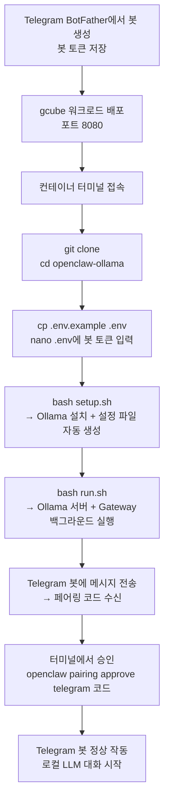

# OpenClaw Telegram AI Agent Gateway (Ollama)

Telegram 봇과 Ollama 로컬 LLM을 연결하는 AI 에이전트 게이트웨이.
API 비용 없이 로컬 모델(qwen3:32b 등)로 OpenClaw를 운영할 수 있도록 구성한 레포입니다.
gcube 컨테이너 환경에서 `git clone → setup → run` 3단계로 배포 완료.

---

## 전체 흐름



---

## gcube 워크로드 설정

| 항목 | 값 |
|------|-----|
| 이미지 | `ollama/ollama:latest` |
| 포트 | `8080` |
| 초기명령어 | `bash -c "apt-get update -qq && apt-get install -y nano vim && sleep infinity"` |

> Ollama는 컨테이너 이미지에 포함되어 있습니다. Node.js 22 및 OpenClaw는 `setup.sh`가 자동으로 설치합니다.

---

## 사전 준비

### Telegram 봇 토큰 발급

- Telegram에서 `@BotFather` 검색 (파란 체크 확인)
- `/newbot` 입력 → 봇 이름, 유저네임 설정
- 발급된 토큰(`123456:ABC...` 형식) 저장

> Anthropic API 키, Gemini API 키 발급 불필요. Ollama가 로컬에서 LLM을 실행합니다.

---

## 실행 방법

### 1. Clone

```bash
git clone <repo-url>
cd openclaw-ollama
```

### 2. 환경변수 설정

```bash
cp .env.example .env
nano .env
```

`.env` 파일 내용:

```env
TELEGRAM_BOT_TOKEN=여기에_봇_토큰_입력
OLLAMA_MODEL=qwen3:32b
OLLAMA_API_KEY=ollama-local
```

### 3. Setup (최초 1회)

```bash
bash setup.sh
```

다음 작업이 자동으로 실행됩니다:

- `packages.txt` 시스템 패키지 설치 (curl, git, zstd, python3)
- Node.js 22 확인 및 설치
- Ollama 설치 확인
- openclaw NPM 패키지 전역 설치
- `~/.openclaw/` 설정 파일 생성
- `~/.openclaw/workspace/` 생성 및 `identity/*.md`, `docs/*.md` 문서 복사

### 4. Gateway 실행

```bash
bash run.sh
```

출력 예시:

```
✅ Gateway 실행 중 (PID: 12345)
━━━━━━━━━━━━━━━━━━━━━━━━━━━━━━━━━━━━━━━━━━━━━━━━━━━━━
🤖 모델: qwen3:32b
🌐 gcube URL로 접속 후 Overview 페이지에서:
   Gateway Token 필드에 아래 토큰 입력 후 Connect

🔑 토큰: <auto-generated-token>
━━━━━━━━━━━━━━━━━━━━━━━━━━━━━━━━━━━━━━━━━━━━━━━━━━━━━
```

> **WebUI 접속**: 출력된 토큰을 gcube URL의 Overview 페이지 → Gateway Token 필드에 입력 후 Connect.

### 5. Telegram 페어링

1. 생성한 Telegram 봇에 메시지 전송
2. 봇이 보내주는 페어링 코드 복사
3. 터미널에서 승인:

```bash
openclaw pairing approve telegram [코드]
```

승인 완료 후 봇과 대화 시작 가능.

---

## Knowledge Base 문서

`docs/` 폴더에 Markdown 파일을 저장하면, `setup.sh` 실행 시 자동으로 에이전트 workspace(`~/.openclaw/workspace/`)에 복사됩니다.
`identity/` 폴더의 `IDENTITY.md`, `AGENTS.md`도 동일하게 복사되어 에이전트 정체성과 행동 지침을 정의합니다.

```bash
# 1. docs/ 폴더에 문서 추가
docs/
├── test_report.md
├── user_manual.md
└── faq.md

# 2. setup.sh 실행 (자동 복사)
bash setup.sh

# 3. 복사 확인
ls ~/.openclaw/workspace/
# 출력: AGENTS.md  IDENTITY.md  test_report.md  user_manual.md  faq.md
```

에이전트는 workspace의 문서를 참조하여 사용자 질문에 답변합니다.

**질문 예시**: "test report의 작성 날짜는?"
**기대 응답**: 문서 내용 기반 답변 (예: "2026년 3월 5일입니다")

---

## 테스트 성공 기준

| 항목 | 방법 | 성공 기준 |
|------|------|----------|
| 1. Gateway 실행 | `bash run.sh` 후 프로세스 확인 | PID 출력, 로그에 에러 없음 |
| 2. WebUI 접속 | gcube URL 브라우저 접속 → Gateway Token 입력 | Overview 페이지 정상 표시 |
| 3. Telegram 연결 | 봇에 메시지 전송 | 페어링 코드 수신 |
| 4. 페어링 승인 | `openclaw pairing approve telegram [코드]` | 승인 완료 메시지 |
| 5. AI 응답 | 봇에 "안녕, 넌 뭘 할 수 있어?" 전송 | 로컬 LLM 기반 한국어 텍스트 응답 수신 |
| 6. 에이전트 정체성 | "자기소개해줘" 전송 | "DA Assistant", "담당자님" 호칭 포함 응답 |
| 7. 한국어 응답 | 영어로 질문 전송 | 한국어로 답변 |
| 8. 문서 기반 Q&A | 봇에 문서 관련 질문 전송 | workspace 문서 기반 정확한 답변 |

---

## 파일 구조

```
openclaw-ollama/
├── README.md              ← 실행 방법 (이 파일)
├── identity/              ← 에이전트 Bootstrap 파일
│   ├── AGENTS.md          ← 에이전트 지시사항 (한국어 답변)
│   └── IDENTITY.md        ← 에이전트 정체성 (DA Assistant)
├── docs/                  ← Knowledge Base 문서 저장소
│   └── test_report.md     ← 테스트 검증용 문서
├── setup.sh               ← 최초 1회: Ollama 설치 + ~/.openclaw 설정 자동 생성
├── run.sh                 ← Ollama 서버 + gateway 실행 + Telegram 페어링 안내
├── packages.txt           ← apt 설치 패키지 목록 (curl, git, zstd, python3)
├── .env.example           ← 환경변수 형식 가이드 (git 추적됨)
├── .env                   ← 실제 봇 토큰 (git 무시됨)
└── .gitignore
```

런타임 생성 디렉토리:

```
~/.openclaw/
├── openclaw.json          ← 게이트웨이 + 채널 설정
├── workspace/             ← 에이전트 작업 공간 (identity/*.md, docs/*.md 복사됨)
│   ├── AGENTS.md
│   ├── IDENTITY.md
│   └── *.md               ← docs/ 에서 복사된 Knowledge Base 문서
├── agents/main/agent/
│   └── auth-profiles.json ← Ollama API 연결 정보 (localhost:11434)
├── ollama.log             ← Ollama 서버 로그
└── gateway.log            ← 게이트웨이 로그
```

---

## 모델 변경

`.env`에서 `OLLAMA_MODEL` 값만 바꾸고 `run.sh`를 다시 실행합니다.

```env
OLLAMA_MODEL=qwen3:32b       # 권장 (tool calling 안정적, 고품질)
# OLLAMA_MODEL=qwen3:8b      # 경량 버전 (약 5GB)
# OLLAMA_MODEL=llama3.1:8b   # tool calling 지원
# OLLAMA_MODEL=qwen2.5:7b    # 한국어 품질 우수
```

> **주의:** `deepseek-r1` 계열 모델은 tool calling을 지원하지 않아 OpenClaw와 호환되지 않습니다.

---

## 문제 해결

### Gateway 실행 실패

```bash
cat ~/.openclaw/gateway.log
```

### Ollama 서버 미응답

```bash
cat ~/.openclaw/ollama.log
pkill -9 -f "ollama" 2>/dev/null || true
bash run.sh
```

### 프로세스 정리 및 재시작

```bash
pkill -9 -f "openclaw" 2>/dev/null || true
pkill -9 -f "ollama" 2>/dev/null || true
sleep 2
bash run.sh
```

### Telegram 봇 미응답

페어링 상태 확인 및 재시도:

```bash
openclaw pairing list
openclaw pairing approve telegram [코드]
```

### 문서가 복사되지 않음

1. `docs/` 폴더 확인: `ls docs/`
2. `.md` 파일 확인: `ls docs/*.md`
3. `setup.sh` 재실행: `bash setup.sh`
4. workspace 확인: `ls ~/.openclaw/workspace/`

---

## 주요 명령어

```bash
# 설정 초기화 (최초 1회 또는 설정 리셋)
bash setup.sh

# 게이트웨이 실행
bash run.sh

# 전체 재시작
pkill -9 -f "openclaw" 2>/dev/null || true && pkill -9 -f "ollama" 2>/dev/null || true && sleep 2 && bash run.sh

# Ollama 로그 확인
cat ~/.openclaw/ollama.log

# Gateway 로그 확인
cat ~/.openclaw/gateway.log

# 페어링 목록 확인
openclaw pairing list

# 페어링 승인
openclaw pairing approve telegram [코드]

# 프로세스 종료
pkill -9 -f "openclaw" 2>/dev/null || true
pkill -9 -f "ollama" 2>/dev/null || true

# 설정 파일 확인
cat ~/.openclaw/openclaw.json

# workspace 파일 확인
ls ~/.openclaw/workspace/

# 설치된 Ollama 모델 목록
ollama list
```

---

## 기술 스택

| 레이어 | 기술 |
|--------|------|
| 런타임 | Node.js 22 (openclaw NPM 패키지) |
| AI 모델 | Ollama 로컬 LLM (`qwen3:32b` 기본, `.env`에서 변경 가능) |
| LLM 서버 | Ollama (`http://localhost:11434`) |
| 채널 | Telegram Bot API (현재 단독 운영, 추후 Slack 추가 예정) |
| 인프라 | gcube 컨테이너 (`ollama/ollama:latest`) |
| 설정 관리 | `~/.openclaw/openclaw.json`, `auth-profiles.json` |
| 스크립트 | Bash (`setup.sh`, `run.sh`) |
